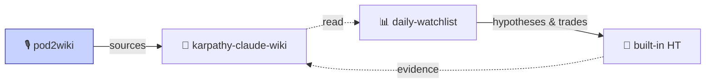

[中文](#中文) | [English](#english)

[](https://github.com/alingowangxr/pod2wiki/releases/latest)
[](https://github.com/alingowangxr/pod2wiki/actions/workflows/podcast-lint.yml)

> 🎙️ **30 秒看懂 / In 30 seconds**：把高品質播客（YouTube/RSS）和長文 RSS 自動轉成中文摘要 + 英文原文存檔，寫進你的個人 LLM 知識庫。Whisper 轉錄 + DeepSeek 翻譯，一鍵 AI 安裝。
> Turn high-signal podcasts and long-form RSS into Chinese summaries plus archived English transcripts, written into your personal LLM wiki. Whisper + DeepSeek, one-line AI install.

> 🔗 **零代碼 AI 投研三件套** ｜ Zero-code AI investment research toolkit
> **🎙️ pod2wiki 輸入** · 🧠 [karpathy-claude-wiki](https://github.com/alingowangxr/karpathy-claude-wiki) 底座 · 📊 [daily-watchlist](https://github.com/alingowangxr/daily-watchlist) 日常 + 內置假設追踪



---

# 中文

pod2wiki 把高品質播客和長文 RSS 自動轉成 `karpathy-claude-wiki` 相容的 `source-summary` 頁面。它是 wiki 的資訊輸入端：訂閱源負責發現材料，系統負責轉錄/摘要/寫入，wiki 負責長期沉澱。

**主要特性**：
*   🚀 **高效異步**：全鏈路異步並發處理，抓取速度提升 3-5 倍。
*   📊 **專業 Web UI**：內建 FastAPI 網頁控制台，支援多用戶認證、即時進度監控與預算預估。
*   🧠 **智慧引導**：執行前自動估算 LLM 用量與 YouTube 頻率限制風險。
*   🛡️ **穩健恢復**：基於 SQLite 的狀態追蹤，支援斷點續傳 (`--resume`) 與歷史回放 (`--replay`)。
*   🤖 **多模型支援**：內建 Google Gemini、本地 Ollama (Gemma) 及 DeepSeek 支援。

## 推薦：讓 AI agent 幫你裝

複製下面這句話給 Claude Code、Codex、Cursor 或任何能讀寫檔案的 AI agent：

> 幫我按這個協議安裝 pod2wiki：https://github.com/alingowangxr/pod2wiki/blob/main/INSTALL-FOR-AI.md

Agent 會自動完成環境配置、依賴安裝與 dry-run 驗證，並裝好 slash command。

## 快速使用

如果你是開發者，克隆代碼後請先執行 `pip install -e .` 安裝為開發模式。安裝後可直接使用：

```bash
# 1. 環境診斷
pod2wiki doctor

# 2. 啟動網頁控制台（推薦，介面直觀）
pod2wiki ui

# 3. 命令行執行掃描
pod2wiki scan --config config/pod2wiki.config.yaml --days 7 --write-insight-log
```

完整操作手冊請參考 [docs/usage-guide.md](docs/usage-guide.md)。

## 網頁控制台 (Web Console)

執行 `pod2wiki ui` 後訪問 `http://127.0.0.1:8080`：
- **Dashboard**: 即時監控掃描進度，查看最近執行的 S/F/Sk/W 統計。
- **Source Management**: 在網頁上管理頻道、RSS 或搜尋關鍵字，套用 **Starter Packs**。
- **Output Preview**: 直接預覽產出的摘要、原文、翻譯與洞察日誌，支援雙欄對照與影片關鍵幀。
- **Scan Presets**: 儲存常用配置（如「每日快篩」），一鍵發起掃描。

## 核心指令

*   `doctor`: 檢查 Python, ffmpeg, yt-dlp, API Key 與權限。
*   `init`: 快速初始化工作區目錄與模板。
*   `watch`: 背景持久運行，定時自動掃描。
*   `replay <run-id>`: 使用當前配置重新處理歷史快照。
*   `test-feed <url>`: 快速測試單個來源解析。

## Documentation

- [INSTALL-FOR-AI.md](INSTALL-FOR-AI.md): 給 Claude Code、Codex、Cursor 等 AI agent 的安裝協議。
- [docs/usage-guide.md](docs/usage-guide.md): 完整使用說明，包含安裝、設定、CLI、Web Console、恢復與日常操作。
- [docs/release-notes.md](docs/release-notes.md): 本次主要版本更新的功能摘要與變更說明。
- [src/pod2wiki/cli/main.py](src/pod2wiki/cli/main.py): CLI 命令入口。
- [src/pod2wiki/web/app.py](src/pod2wiki/web/app.py): Web Console 入口。

## 專案架構

```
src/pod2wiki/
├── cli/main.py                # 統一命令入口 (Typer)
├── web/                       # FastAPI 網頁控制台
├── collect/                   # 資料收集（RSS / YouTube / 本地檔案）
├── persistence/
│   ├── file.py                # Markdown 持久化
│   └── state.py               # SQLite 狀態追蹤 (pod2wiki_v1.db)
├── reporting/
│   ├── estimator.py           # 成本與工作量估算
│   └── insight_log.py         # 洞察日誌
├── summarize/                 # LLM 摘要服務
├── processing/
│   └── post.py                # 外掛式後處理器（Plugin Hook）
├── transcribe/
│   └── whisper.py             # Whisper 語音轉錄
└── llm_client.py              # 異步 LLM 客戶端
```

---

# English

pod2wiki turns high-signal podcasts and long-form RSS feeds into `source-summary` pages compatible with `karpathy-claude-wiki`. It is the ingestion layer for a research wiki.

**Key Features**:
*   🚀 **High Concurrency**: Async-first engine using `asyncio` and `httpx`, 3-5x faster processing.
*   📊 **Professional UI**: Built-in Web Console for monitoring, source management, and multi-user auth.
*   🧠 **Smart Guidance**: Pre-run workload estimation and YouTube rate-limit risk warnings.
*   🛡️ **Robust Recovery**: SQLite-backed state tracking with `--resume` and `--replay` capabilities.
*   🤖 **Multi-LLM**: Deep integration with Gemini, Ollama (Gemma), and DeepSeek.

## Quick Start

If you are developing from a cloned checkout, install the package first: `pip install -e .`.

```bash
# 1. Diagnostic
pod2wiki doctor

# 2. Launch Web Console (Recommended)
pod2wiki ui

# 3. CLI Scan
pod2wiki scan --config config/pod2wiki.config.yaml --days 7
```

For the full operating guide, see [docs/usage-guide.md](docs/usage-guide.md).

## Web Console

Run `pod2wiki ui` and open `http://127.0.0.1:8080`:
- **Dashboard**: Real-time progress bars and S/F/Sk/W statistics.
- **Management**: Add/Remove feeds via UI, apply **Starter Packs**.
- **Preview**: Integrated viewer for Sources, Raw, and Translations with side-by-side review.
- **Presets**: Save your favorite scan configs for one-click execution.

## Core Commands

*   `doctor`: Check environment, binaries, and API keys.
*   `init`: Initialize workspace directories and templates.
*   `watch`: Continuous background scanning.
*   `replay <run-id>`: Re-process historical data with updated prompts.
*   `test-feed <url>`: Verify a single source quickly.

## Documentation

- [INSTALL-FOR-AI.md](INSTALL-FOR-AI.md): installation protocol for Claude Code, Codex, Cursor, and other AI agents.
- [docs/usage-guide.md](docs/usage-guide.md): full operating guide covering setup, configuration, CLI, Web Console, recovery, and daily workflows.
- [docs/release-notes.md](docs/release-notes.md): summary of the major features and repository changes in this release.
- [src/pod2wiki/cli/main.py](src/pod2wiki/cli/main.py): CLI entry point.
- [src/pod2wiki/web/app.py](src/pod2wiki/web/app.py): Web Console entry point.

## License

MIT.
