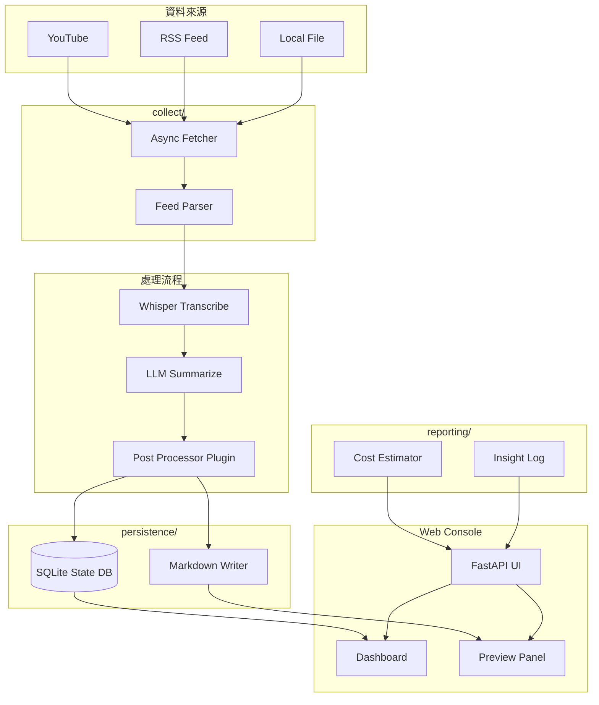
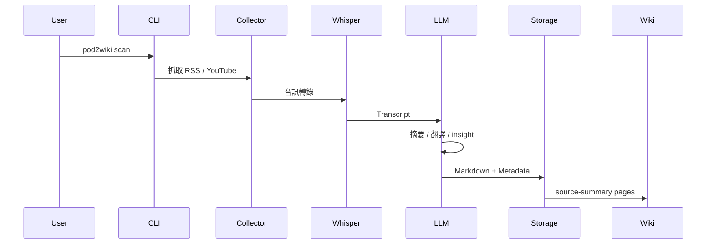
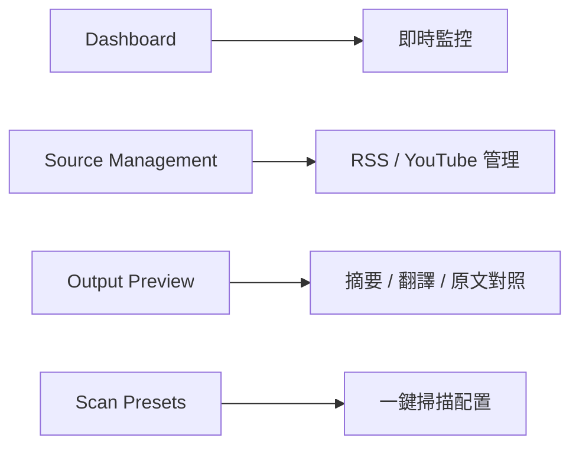

# pod2wiki 功能架構圖 + 快速指令參考卡

Repo：[alingowangxr/pod2wiki](https://github.com/alingowangxr/pod2wiki?utm_source=chatgpt.com)

根據 README 與專案目錄整理。pod2wiki 是一個把 YouTube / Podcast / RSS 長文，自動轉為可寫入個人 LLM Wiki 的 ingestion pipeline。支援 Whisper 轉錄、LLM 摘要、FastAPI Web UI、SQLite 狀態追蹤與 async pipeline。

來源：([github.com](http://github.com))

---

# 1. 系統定位圖（在整個 AI 投研工作流中的位置）


## 核心角色

| 模組 | 作用 |
| --- | --- |
| pod2wiki | 資訊 ingestion layer |
| Whisper | Podcast / YouTube 語音轉錄 |
| LLM | 中文摘要 / 翻譯 / insight |
| karpathy-claude-wiki | 長期知識庫 |
| daily-watchlist | 每日研究與交易追蹤 |

---

# 2. pod2wiki 內部功能架構圖



---

# 3. 專案目錄結構解析

```text
src/pod2wiki/
├── cli/main.py
│   └── Typer CLI 統一入口
│
├── web/
│   └── FastAPI Web Console
│
├── collect/
│   └── RSS / YouTube / Local File 收集器
│
├── transcribe/
│   └── Whisper 語音轉錄
│
├── summarize/
│   └── LLM 摘要與翻譯
│
├── processing/
│   └── 後處理 Plugin Hook
│
├── persistence/
│   ├── file.py
│   │   └── Markdown 寫入
│   └── state.py
│       └── SQLite 狀態追蹤
│
├── reporting/
│   ├── estimator.py
│   │   └── Token / Cost 預估
│   └── insight_log.py
│       └── 洞察日誌
│
└── llm_client.py
    └── Async LLM Client

```

來源：([github.com](http://github.com))

---

# 4. 核心 Pipeline（資料流）



---

# 5. 技術 Stack

| 類別 | 技術 |
| --- | --- |
| CLI | Typer |
| Web UI | FastAPI |
| Async | asyncio + httpx |
| Transcription | Whisper |
| Database | SQLite |
| LLM | Gemini / DeepSeek / Ollama |
| Downloader | yt-dlp |
| Media | ffmpeg |

---

# 6. 快速 CLI 指令參考卡（Cheat Sheet）

## 安裝

```bash
git clone https://github.com/alingowangxr/pod2wiki
cd pod2wiki
pip install -e .

```

---

## 環境診斷

```bash
pod2wiki doctor

```

檢查：

- Python
- ffmpeg
- yt-dlp
- API Keys
- 權限與依賴

---

## 啟動 Web UI

```bash
pod2wiki ui

```

預設：

```text
http://127.0.0.1:8080

```

功能：

- Dashboard
- Feed 管理
- 即時進度
- Output Preview
- Presets

---

## 執行掃描

```bash
pod2wiki scan \
  --config config/pod2wiki.config.yaml \
  --days 7 \
  --write-insight-log

```

用途：

- 抓 RSS / YouTube
- Whisper 轉錄
- LLM 摘要
- 生成 Markdown
- 寫入 wiki

---

## 持續背景監控

```bash
pod2wiki watch

```

適合：

- 長期自動化 ingestion
- 每日研究資料同步

---

## 回放歷史 Run

```bash
pod2wiki replay <run-id>

```

用途：

- 用新 prompt 重跑舊資料
- 修正摘要策略
- 重建 wiki 頁面

---

## 測試單一 Feed

```bash
pod2wiki test-feed <url>

```

用途：

- 驗證 RSS / YouTube source
- Debug parser

---

## 初始化 Workspace

```bash
pod2wiki init

```

建立：

- config
- template
- workspace 目錄

---

# 7. Web Console 功能圖



---

# 8. 與一般 Podcast 摘要工具的差異

| 一般工具 | pod2wiki |
| --- | --- |
| 單次摘要 | 長期知識沉澱 |
| 只有 transcript | source-summary wiki page |
| 手動流程 | 全 async pipeline |
| 無狀態 | SQLite recovery |
| 單模型 | 多 LLM backend |
| 無 UI | FastAPI Console |
| 只做轉錄 | 可接投研 workflow |

---

# 9. 最適合的使用情境

## AI 投研

- 財經 Podcast
- AI 技術訪談
- Earnings Call
- YouTube 長影片
- Substack / RSS

## 個人知識庫

- 建立長期 LLM memory
- 對接 Claude Wiki / Obsidian
- 個人研究系統

## Agent Workflow

可接：

- Claude Code
- Codex CLI
- Cursor
- Gemini CLI

形成：

```text
Information Ingestion
    ↓
LLM Summarization
    ↓
Knowledge Wiki
    ↓
Daily Research Loop

```

---

# 10. 一句話總結

pod2wiki 本質上是一個：

「面向 LLM 知識庫的 Podcast / RSS ingestion engine」

它不是單純摘要工具，而是 AI Research Stack 的資料輸入層。

---

# 11. 重要文件入口

- README
- [INSTALL-FOR-AI.md](http://INSTALL-FOR-AI.md)
- docs/[usage-guide.md](http://usage-guide.md)
- src/pod2wiki/cli/[main.py](http://main.py)
- src/pod2wiki/web/[app.py](http://app.py)

來源：citeturn2

